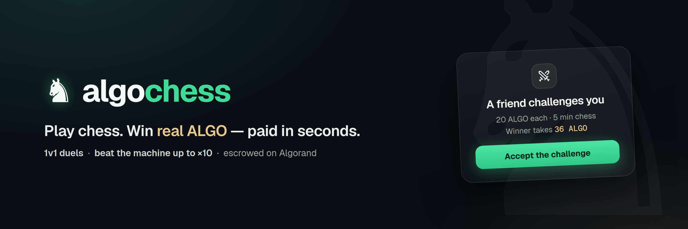
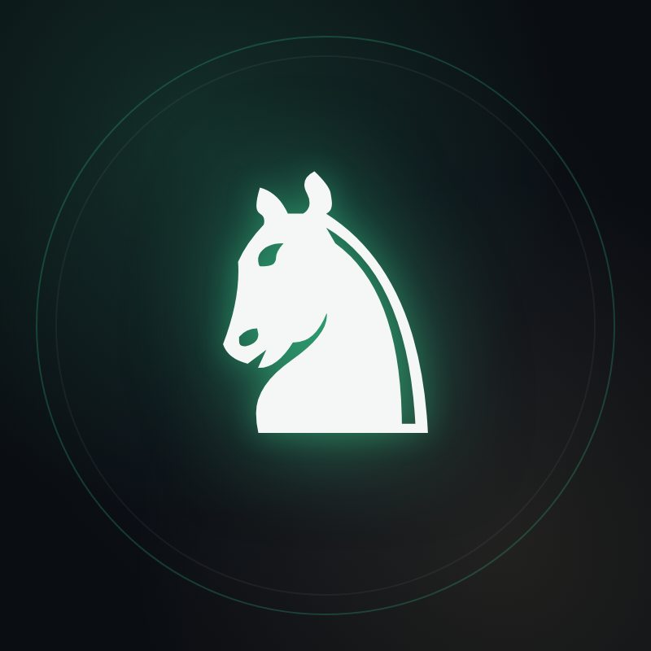

# AlgoChess brand visuals

Brand assets for [AlgoChess](https://algo-chess.replit.app) — chess duels for
real ALGO on Algorand MainNet.

| Asset | File | Size | Use |
|---|---|---|---|
| Avatar | [`avatar.png`](./avatar.png) | 800×800 (2×) | X/Twitter profile picture, favicons, app stores |
| Banner | [`banner.png`](./banner.png) | 3000×1000 (2×, 3:1) | X/Twitter header |

## Palette

- Abyss (background) `#0a0d12`
- Jade (action) `#3ddc97`
- Gold (money) `#e6c88a`
- Ink (text) `#f4f7f5`

Typeface: [Geist](https://vercel.com/font) · knight glyph: DejaVu Sans `♞`

## Regenerating

The images are rendered from the HTML sources in [`src/`](./src) at
device-scale 2 (viewport 400×400 and 1500×500) with headless Chromium —
edit the HTML, screenshot, done. The `file://` font paths point at the
`geist` npm package.
