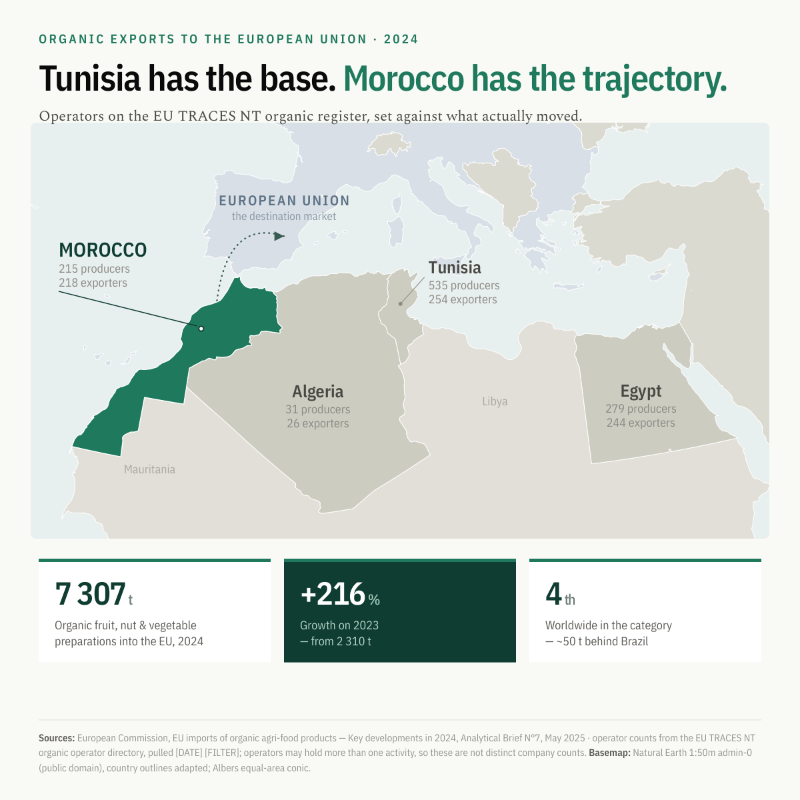

# The Organic Market of Morocco — 2026 Sector Report

**[📄 Read the report (PDF, 39 pages)](Morocco-Organic-Market-Report-2026.pdf)**



A desk-research report on Moroccan organic agriculture: certified land, operators and
output; the EU trade framework that changed on 1 January 2025; a directory of verified
producers and exporters; and a benchmark against every country in Africa.

Everything is published open: the PDF, the CSV datasets behind every figure and table, and
the script that renders the document. Nothing in the report is typed by hand into a chart —
correct a CSV, rebuild, and the report follows.

---

## The short version

Morocco is not an organic-area player. It is an organic-*value* player.

- On certified hectares it is marginal: **13 325 ha** (2023 data year) — about **0.4 %** of
  Africa's organic agricultural land, roughly one thirty-eighth of Uganda's, and **28 %
  below its own 2022 peak** of 18 531 ha.
- On trade it is not: in 2024 Morocco was the **4th largest third-country supplier of
  organic *preparations of fruit, nuts and vegetables* to the EU**, at **7 307 t**, a
  volume that had **more than tripled** in twelve months. It does not appear in the top
  ten for raw organic fruit and nuts. The margin is in the transformation.
- The decisive regulatory date for Moroccan exporters was **1 January 2025**, not the
  31 December 2026 deadline the trade press reports. Morocco was **never** on the EU's
  equivalent-third-country list — Tunisia is the only African country on it — so Morocco's
  exporters used the *control body* route, which expired on 31 December 2024.
- Having no equivalence to lose turned out to be an advantage. Africa's certified organic
  farmland **fell about 17.6 % in 2024**, the first decline since 2011, which FiBL
  attributes to that same compliance requirement. African organic cocoa exports fell 22.7 %
  over the same period. Moroccan exporters, already certified directly against EU rules,
  absorbed the change as an adjustment rather than a rupture.
- The 2030 target of **100 000 ha** requires roughly **nine times** the rate of conversion
  the sector has ever demonstrated, during a drought in which irrigation allocation ran at
  about 17 % of planning volume. Section 8.2 works the arithmetic.

Full findings, with sources and evidence grades, are in the PDF.

## How this report handles evidence

Every tabulated figure carries a **data year**, a **source reference** keyed to a
138-entry register, and an **evidence grade** — because Moroccan organic statistics
disagree with each other, and the report shows the disagreement rather than averaging it
away.

| Grade | Meaning |
|:-----:|---------|
| **A** | Primary source opened directly and the figure read from it |
| **B** | Attributable to a named primary document with a data year, retrieved indirectly, and arithmetically self-consistent or independently corroborated |
| **C** | Single secondary rendering, or a figure whose data year could not be established |
| **D** | Contested or failed verification — reported for transparency, never relied on |

**No figure in this edition carries grade A.** The network policy in the compilation
environment refused connections to every statistical and regulatory host attempted
(`fibl.org`, `statistics.fibl.org`, `orgprints.org`, `agriculture.ec.europa.eu`,
`eur-lex.europa.eu`), so no primary PDF was opened; their content reached the report
through a search index. Section 2.1 of the PDF states exactly what that limits and what it
does not, and Table 2.2 lists the ten open questions a future edition should close.

Two figures were resolved by arithmetic rather than by opening the source, and the working
is shown in Section 2.3 — one confirmed (Morocco's import row reconciles to the tonne), one
rejected (a supplier share table that reconciles to the wrong year's total).

## Repository layout

```
├── Morocco-Organic-Market-Report-2026.pdf   the report
├── data/                                    the open datasets — 14 CSVs
│   ├── africa_organic_land.csv              all 54 African states
│   ├── morocco_area_series.csv              the contradictory area series, with its bases
│   ├── morocco_organic_operators.csv        the producer / exporter directory
│   ├── eu_fruitveg_preparations_2024.csv    the category where Morocco ranks 4th
│   ├── eu_regulatory_timeline.csv           equivalence → compliance, dated
│   ├── sources.csv                          the 138-entry source register
│   └── …
├── src/                                     the report build
│   ├── build.py                             CSV → HTML fragments → PDF
│   ├── charts.py                            figure renderers (inline SVG / HTML)
│   ├── report.html                          the document
│   ├── styles.css                           CSS Paged Media stylesheet
│   └── fonts/fetch-fonts.sh                 pulls the OFL typefaces
└── visual/                                  the shareable graphic
    ├── morocco-organic-map-2400.png         2400 × 2400
    ├── morocco-organic-map-1200.png         1200 × 1200
    ├── makemap.py                           projection + country geometry
    ├── compose.py                           layout → PNG
    └── fetch-basemap.sh                     pulls Natural Earth 1:50m
```

Every CSV carries per-row source references and, where applicable, an evidence grade, so a
figure in the PDF can be traced to a row and a row to a URL.

## Rebuilding the PDF

```bash
pip install weasyprint pyphen
src/fonts/fetch-fonts.sh        # once — font binaries are not committed
cd src && python3 build.py      # -> ../Morocco-Organic-Market-Report-2026.pdf
```

The report is rendered from HTML and CSS through WeasyPrint. Charts are generated as inline
SVG and HTML rather than as images, so the PDF is fully vector and figures inherit the
document's typography. `build.py` fails loudly if `report.html` contains a token no dataset
fills.

## Rebuilding the visual

```bash
src/fonts/fetch-fonts.sh        # if not already done
visual/fetch-basemap.sh         # Natural Earth 1:50m, ~3 MB, not committed
cd visual && python3 makemap.py && python3 compose.py
```

`makemap.py` projects country geometry to an Albers equal-area conic (standard parallels
21°N / 37°N, central meridian 10°E) and emits SVG paths; `compose.py` lays out the graphic
and rasterises it. Nothing is hand-drawn, so edits are a re-run rather than a redraw.

Two notes on the basemap. EU-27 member states are tinted separately from non-EU Europe and
the Levant, so the "European Union" label covers only what it says. And Morocco is drawn as
a single continuous territory — the Natural Earth `MAR` and `ESH` features are dissolved
with a geometric union, so no internal boundary is rendered. That is a deliberate editorial
choice, not the Natural Earth default; note that in EU trade law, which is the subject of
the report, the CJEU held on 4 October 2024 (Case C-399/22) that Western Sahara is a
separate customs territory with its own origin labelling.

## Scope, and what this is not

- **Not a substitute for the primary sources.** The FiBL/IFOAM *World of Organic
  Agriculture* yearbook country tables and the European Commission's full organic-import
  origin tables would settle most of the open questions. Buy or open them.
- **Not commissioned or endorsed** by any organisation named in it.
- **The producer directory is a research finding, not a recommendation, an accreditation,
  or a due-diligence report.** Certification is a moving state and these entries are a
  snapshot: 16 operators verified with a live source, 6 partially verified, 8 confirmed
  only through a certifier's public register. Verify current certificates directly with the
  certifying body before contracting. Section 5.4 lists the well-known names deliberately
  excluded for want of evidence, which is as informative as the inclusions.
- **`no data reported` means exactly that** — the absence of a public figure, not an
  absence of activity. Only 9 of 54 African states carry an attributable organic land
  figure.

## Corrections

Corrections are welcome and are most useful as a change to the relevant CSV row together
with the source that supports it. The ten open questions in Table 2.2 of the report are the
highest-value place to start; closing any of them would materially improve the next edition.

## Licence

Report and datasets: **CC BY 4.0**. Build code: **MIT**. The underlying statistics belong to
the organisations credited in Annex A and their own terms govern — when you quote a figure,
cite its original source and its data year, not this repository alone. See [LICENSE](LICENSE).
